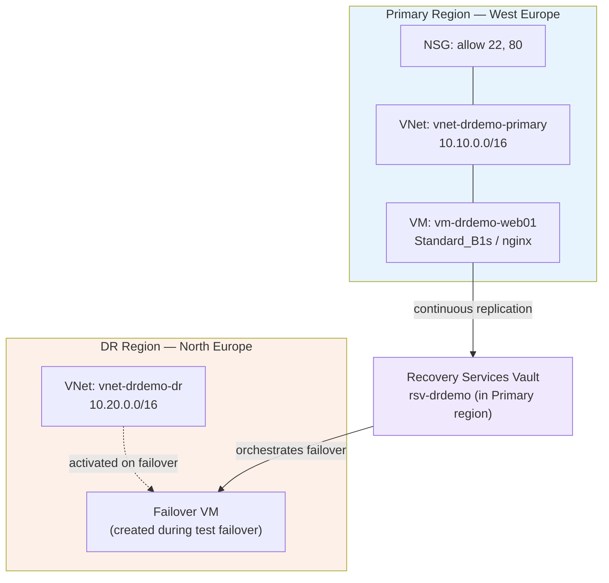

# Architecture

## Overview

A single-VM web workload in **West Europe** (primary), replicated to
**North Europe** (DR) using **Azure Site Recovery**. Scoped deliberately to
one VM and no database tier to keep this a same-day, low-cost, high-signal
proof of the DR failover mechanism rather than a full production topology.

## Diagram

 Design decisions

- **Vault lives in the DR region (NORTH EUROPE)** — this is the Azure-recommended
  pattern; the vault needs to survive if the primary region is what fails, not
  the DR. If the primary region has a full regional outage, a vault sitting in that same region could become unreachable right when you need it most to orchestrate the failover, defeating the purpose of DR.
  Placing the vault in (or near) the DR region means it's naturally co-located with where you'd be managing recovery operations from during an actual incident.

- DR VNet address space (10.20.0.0/16) doesn't overlap primary
  (10.10.0.0/16)**  required for any future VNet peering.
- **Single VM, no load balancer, no managed database** — This is scoped down
  intentionally for cost and time. Noted here as an explicit "phase 2"
  extension rather than a limitation nobody thought about. I could go forward and:
  - Add an Availability Set / VMSS + Load Balancer in primary
  - Replace the flat web tier with Azure SQL + auto-failover groups
    (a different failover mechanism than ASR — worth knowing both)
  - Add Azure Front Door for automatic DNS-based traffic steering on failover
- **Test failover, not full planned failover** — non-disruptive, matches how
  most real DR plans are actually exercised on a recurring cadence (quarterly
  DR drills), rather than a full production cutover.

NOTE: Azure auto-creates a NIC-level NSG when using certain quick-create paths, separate from the subnet-level NSG, both must allow required ports.
NOTE: Standard SKU public IPs deny all inbound traffic by default unless an NSG explicitly allows it, unlike Basic SKU IPs. A VM with no NSG attached at all is not more open, it's fully closed.
## Recovery objectives (targets vs. actuals)

| Metric | Target | Actual (see test-failover-results.md) |
|---|---|---|
| RTO (Recovery Time Objective) | < 15 min | 50 min (~3 min for the ASR job itself; remainder was one-time DR network setup. see notes) |
| RPO (Recovery Point Objective) | < 1 hour | 1 min |

RPO came in well under target. RTO missed the target on paper, but as noted in test-failover-results.md, the actual ASR mechanism was fast (~3 min); the gap was first-time DR network configuration, not the failover process itself.